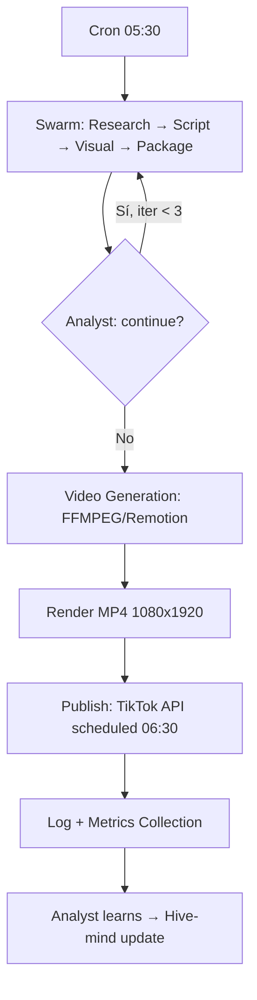

# VideoTikTok - Pipeline Automatizado de Videos Motivacionales

> Sistema multi-agente para generar y publicar videos motivacionales diarios en TikTok (30-60 seg)

## 🎯 Objetivo
Producir **1 video diario** optimizado para el algoritmo de TikTok:
- Hook en primeros 3 segundos
- Storytelling visual + lección aplicable
- CTA accionable + hashtags estratégicos
- Programado en hora óptima (GMT-5 Perú)

## 🏗️ Arquitectura: Ruflo / Claude-Flow (Elección ganadora)

```
┌─────────────────────────────────────────────────────────────┐
│                    TIKTOK MOTIVATION SWARM                  │
├─────────────────────────────────────────────────────────────┤
│  🔍 Researcher (Trend Scout)                                │
│      │ hooks virales, ángulos, hashtags, hora óptima        │
│      ▼                                                      │
│  ✍️ Writer (Copywriter Motivacional)                         │
│      │ guion 45s: hook → story → lesson → CTA               │
│      ▼                                                      │
│  🎨 Creative (Creative Director)                            │
│      │ shot list, música, subtítulos, transiciones          │
│      ▼                                                      │
│  📦 Optimizer (Growth Optimizer)                            │
│      │ caption, hashtags, post_time, thumbnail, 1st comment │
│      ▼                                                      │
│  📊 Analyst (Performance Analyst)  ◄── FEEDBACK LOOP ──────┘
│      │ métricas simuladas → advice para siguiente iteración  │
└─────────────────────────────────────────────────────────────┘
         │
         ▼
    ┌──────────────────────────────────────────┐
    │         VIDEO GENERATION LAYER           │
    │  FFMPEG / Remotion → MP4 1080x1920       │
    │  Subtítulos quemados + música + overlays  │
    └──────────────────────────────────────────┘
         │
         ▼
    ┌──────────────────────────────────────────┐
    │           PUBLISH LAYER                  │
    │  TikTok API / Webhook → Scheduled post   │
    │  Logs + métricas reales 24h/7d           │
    └──────────────────────────────────────────┘
```

## 🚀 Quick Start

### Prerrequisitos
- Node.js 18+
- Python 3.10+ (para FFMPEG/Remotion)
- FFMPEG instalado
- OpenClaw gateway corriendo (para LLM)

### Instalación

```bash
# Clonar repo
git clone https://github.com/jvaldivia13/videoTicktock.git
cd videoTicktock

# Dependencias Node (Ruflo/Claude-Flow)
npm install

# Dependencias Python (video generation)
python3 -m venv venv
source venv/bin/activate
pip install -r requirements.txt

# FFMPEG (Ubuntu/Debian)
sudo apt install ffmpeg
```

### Configuración

```bash
cp .env.example .env
# Editar .env con tus keys:
# - OPENCLAW_GATEWAY_URL=http://localhost:18789
# - TIKTOK_API_KEY=...
# - STOCK_VIDEO_API=... (Pexels/Storyblocks)
# - MUSIC_API=... (Epidemic/Artlist/YouTube Audio)
```

### Ejecutar pipeline (1 iteración)

```bash
# Solo swarm (genera paquete JSON)
npm run swarm -- --topic "disciplina matutina"

# Pipeline completo: swarm + video + publish
npm run pipeline -- --topic "disciplina matutina" --publish

# Modo daily cron (para systemd/cron)
npm run daily
```

## 📁 Estructura del Proyecto

```
videoTicktock/
├── .github/
│   └── workflows/
│       └── daily-pipeline.yml      # GitHub Actions para daily run
├── src/
│   ├── swarm/
│   │   ├── config.json             # Swarm declarativo (agentes, workflow, loop)
│   │   ├── agents/                 # Agentes personalizados
│   │   │   ├── researcher.js
│   │   │   ├── writer.js
│   │   │   ├── creative.js
│   │   │   ├── optimizer.js
│   │   │   └── analyst.js
│   │   └── index.js                # Entry point swarm
│   ├── video/
│   │   ├── generator.py            # FFMPEG/Remotion video generation
│   │   ├── templates/              # Plantillas de video
│   │   └── assets/                 # Stock footage, música, fuentes
│   ├── publish/
│   │   ├── tiktok.js               # TikTok API client
│   │   └── scheduler.js            # Programación de posts
│   └── shared/
│       ├── memory.js               # Hive-mind persistence
│       ├── metrics.js              # Métricas reales + simuladas
│       └── config.js               # Config centralizada
├── tests/
│   ├── swarm.test.js
│   └── video.test.py
├── scripts/
│   ├── setup.sh
│   ├── daily-cron.sh
│   └── deploy.sh
├── data/
│   ├── swarm-memory/               # Hive-mind persistence (JSON/LevelDB)
│   ├── videos/                     # Videos generados
│   └── logs/                       # Execution logs
├── spike/                          # Spike comparativo original
│   ├── langchain_pipeline.py
│   ├── ruflo_swarm.js
│   └── comparison.md
├── package.json
├── requirements.txt
├── .env.example
├── README.md
└── tsconfig.json
```

## 🔄 Flujo Diario (Cron 05:30 GMT-5)



## 📊 Métricas Clave (KPIs)

| Métrica | Target | Fuente |
|---------|--------|--------|
| Views 24h | >10k | TikTok Analytics |
| Avg Watch % | >60% | TikTok Analytics |
| Shares | >50 | TikTok Analytics |
| Saves | >100 | TikTok Analytics |
| Comments | >30 | TikTok Analytics |
| CTR Profile | >2% | TikTok Analytics |
| Cost/Video | <$0.50 | Internal |

## 🧠 Hive-Mind Learning Loop

El **Analyst** no solo simula métricas — aprende de las **reales**:

```json
{
  "iteration": 1,
  "real_metrics": {"views": 12400, "avg_watch_pct": 67, "shares": 89},
  "learned": {
    "best_hook_style": "pregunta_directa_relatable",
    "best_angle": "sistema_concreto_vs_motivacion_vaga",
    "optimal_post_time": "06:15",
    "music_mood": "epic_calm_85bpm",
    "visual_style": "pov_personal_no_stock_generico"
  },
  "next_topic_suggestions": ["consistencia vs intensidad", "entorno > voluntad"]
}
```

Esta memoria persiste en `data/swarm-memory/` y alimenta al **Researcher** del día siguiente.

## 🛠️ Comandos Disponibles

```bash
# Swarm only
npm run swarm -- --topic "tu tema" [--iterations 3]

# Video generation from package JSON
npm run video -- --package data/output/package-latest.json

# Publish to TikTok
npm run publish -- --video data/videos/latest.mp4 --package data/output/package-latest.json

# Full pipeline
npm run pipeline -- --topic "disciplina matutina" --publish

# Daily cron job
npm run daily

# Tests
npm test
pytest tests/
```

## 🔧 Tech Stack

| Layer | Technology |
|-------|------------|
| Orchestration | Ruflo / Claude-Flow v3.34+ |
| LLM | NVIDIA Nemotron 3 Ultra / DeepSeek V4 (via OpenClaw gateway) |
| Video Gen | FFMPEG (primary) / Remotion (complex animations) |
| Stock Media | Pexels API / Storyblocks / YouTube Audio Library |
| Scheduling | node-cron / systemd timer / GitHub Actions |
| Persistence | LevelDB (hive-mind) + JSON logs |
| Deploy | Docker / systemd / GitHub Actions |

## 📈 Roadmap

- [ ] **MVP**: Swarm + FFMPEG + manual publish
- [ ] **v1.0**: TikTok API auto-publish + metrics collection
- [ ] **v1.5**: Remotion templates para animaciones avanzadas
- [ ] **v2.0**: Multi-nicho (gym, emprendimiento, estudio, mindfulness)
- [ ] **v2.5**: A/B testing automático de hooks/thumbnails
- [ ] **v3.0**: Federación multi-cuenta + cross-posting Reels/Shorts

## 🤝 Contribuir

1. Fork → feature branch
2. Añadir tests
3. PR con descripción clara

## 📄 Licencia

MIT — Libre para uso personal y comercial.

---

**Desarrollado con** ❤️ **usando Ruflo/Claude-Flow + OpenClaw**